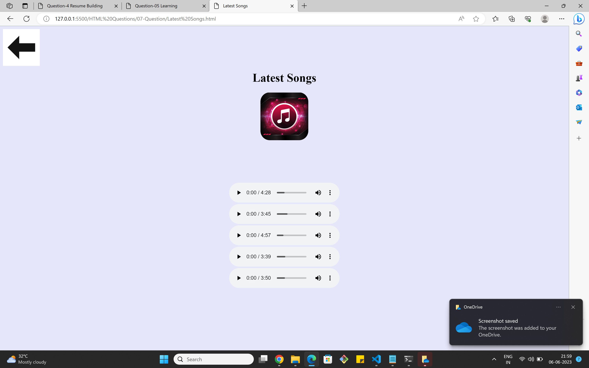
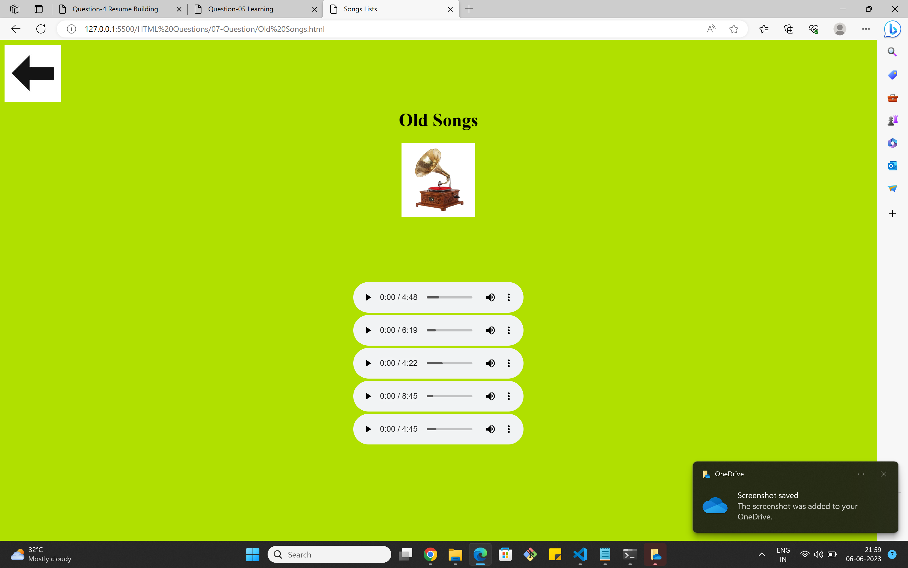

# **Web Development - HTML**
## **Assignment Questions - 01**
## **Question - 07**

**7. Create a simple Music player using html only**

# **OUTPUT Images**

## **Home Page :**

## **When we want to listen Devotional Songs then click on devotional songs :**

## **When we want to listen Latest Songs then click on latest songs :**

## **When we want to listen Old Songs then click on old songs :**

