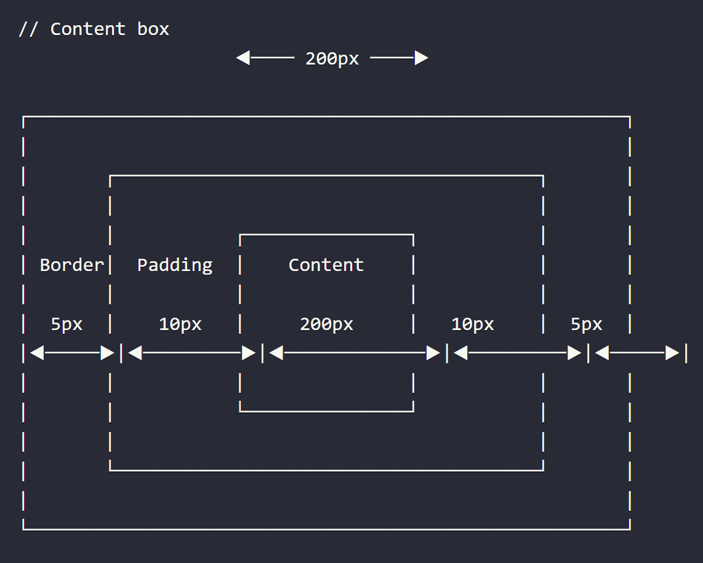
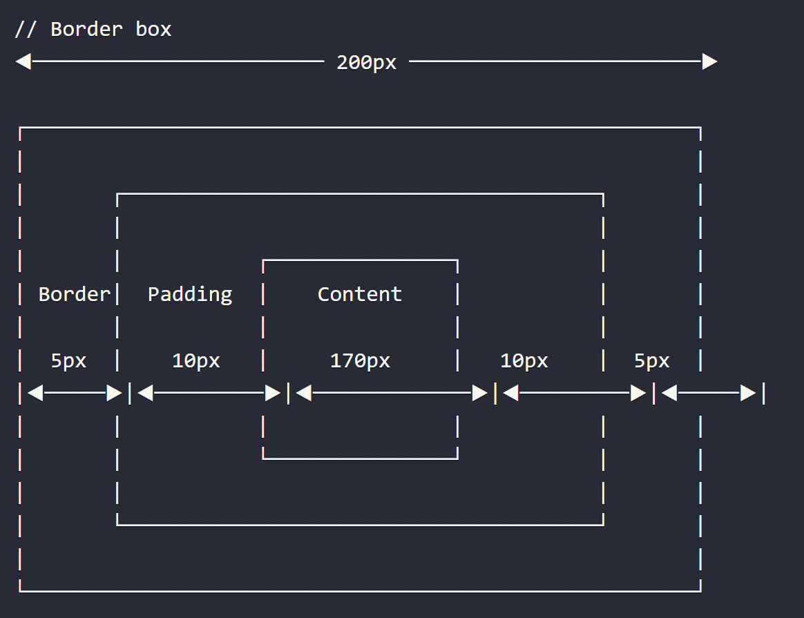

# **Web Development - CSS**
## **Assignment Questions - 02**
## **Question - 05**

**5 How is Border-box different from Content Box?**

**ANSWER :**

- **Border-box** and **Content-box** are two values of the **box-sizing property**. 
- Unlike the content-box, the **border-box value** indicates that the dimension of an element will also include the border and padding.
- Let's assume that we have a div element whose size is 200px x 100px, the border and padding are 5px and 10px respectively.

**Syntax :**

```
.div {
width: 200px;
border: 5px;
padding: 10px;
}
```

- In the **content box model**, the content inside of an element will have the same dimension as the element.

**Syatax :**

```
.div {
width: 200px;
border: 5px;
padding: 10px;
box-sizing: content-box;     
}
```

- The below Image illustrates how the Content box model takes the content area width and height values and also its margins, borders and paddings.



- In the **border box model**, the content's dimension has to subtract the **border** and **padding** from the **element's dimension**. 
Specifically, the content's width is 200 - 5 * 2 - 10 * 2 = 170px.

**Syntax :**

```
.div {
width: 200px;
border: 5px;
padding: 10px;
box-sizing: border-box;    
}
```

- The below Image illustrates how the Content box model takes the content area width and height values and also its margins, borders and paddings.

